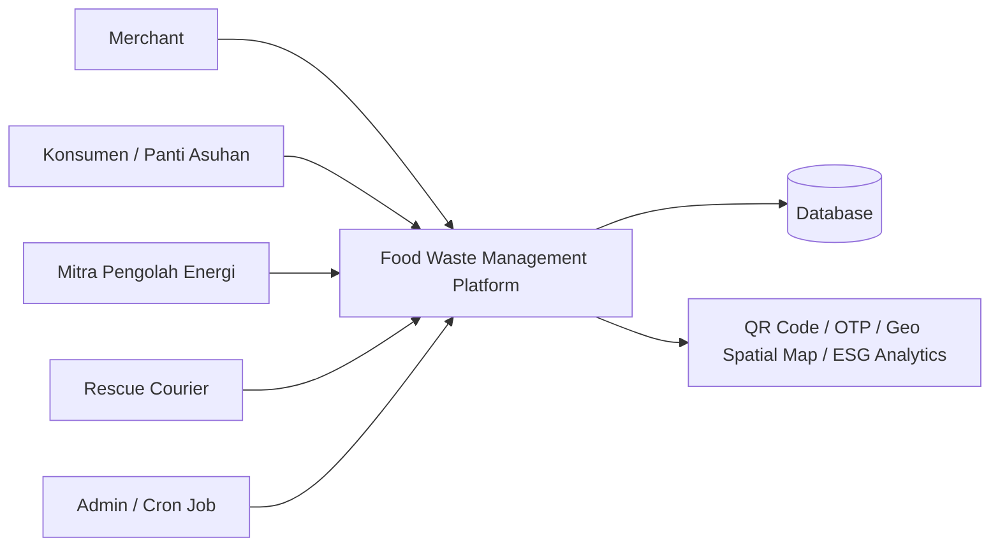

<div align="center">

  # Food Waste Management Platform
  ### Menghubungkan merchant, konsumen, mitra energi, dan kurir dalam satu ekosistem pengelolaan sisa makanan yang lebih efisien, terukur, dan berdampak sosial.

  [](#)
  [](https://github.com/your-username/food-waste-management-platform)
  [](LICENSE)

  **Submission for ITECHNO CUP 2026 - Web Development**

  **By CTRL + S Team**

</div>


## 📋 Daftar Isi

- [Tentang Proyek](#-tentang-proyek)
- [Fitur Unggulan](#-fitur-unggulan)
- [Teknologi](#️-teknologi)
- [Arsitektur Sistem](#️-arsitektur-sistem)
- [Instalasi dan Setup](#️-instalasi--setup)
- [Penggunaan](#-penggunaan)
- [Testing](#-testing)

## 🎯 Tentang Proyek

### Latar Belakang

Sisa makanan masih menjadi masalah yang cukup serius dalam rantai kuliner dan distribusi makanan harian. Di satu sisi, banyak merchant atau bisnis kuliner memiliki stok makanan yang belum sempat terjual dan berpotensi menjadi limbah. Di sisi lain, terdapat masyarakat yang membutuhkan makanan dengan harga terjangkau, panti asuhan yang memerlukan dukungan pangan, serta komunitas pengolah energi yang membutuhkan limbah organik sebagai bahan baku. Kondisi ini menimbulkan kehilangan nilai ekonomi, sosial, dan lingkungan yang seharusnya dapat dioptimalkan.

Food Waste Management Platform dirancang sebagai solusi digital yang menghubungkan berbagai pihak dalam satu ekosistem terintegrasi. Platform ini memungkinkan sisa makanan dikelola secara lebih terstruktur melalui sistem penilaian tier, pelacakan status secara real-time, pemanfaatan teknologi QR Code, serta dashboard analitik berbasis ESG. Dengan pendekatan ini, makanan yang semula berpotensi menjadi limbah dapat dipindahkan ke jalur yang lebih bermanfaat, baik untuk dijual dengan diskon, didonasikan, maupun diolah menjadi energi.

### Solusi yang Ditawarkan

Platform ini menghadirkan model pengelolaan sisa makanan berbasis role dan alur kerja yang jelas. Merchant dapat mengunggah sisa makanan, menetapkan waktu masak, serta mengklasifikasikannya ke dalam Tier 1, Tier 2, atau Tier 3 sesuai tujuan pemanfaatannya. Konsumen dan panti asuhan dapat menemukan penawaran makanan terdekat melalui peta interaktif, sedangkan mitra energi dapat mengakses lokasi limbah organik yang siap diklaim. Kurir lokal juga terlibat untuk membantu pemindahan barang secara cepat dan aman. Semua proses didukung oleh sistem QR Code, verifikasi handover, serta otomatisasi status yang memudahkan pemantauan dari awal hingga akhir.

### Tujuan Proyek


## ✨ Fitur Unggulan

### Fitur Utama

| Fitur | Deskripsi | Keunggulan |
|----------|--------------|---------------|
| **Manajemen Merchant & Tiering** | Merchant dapat mengunggah sisa makanan, mengatur prep_time, dan mengkategorikannya ke Tier 1 (diskon), Tier 2 (donasi), atau Tier 3 (limbah energi). | Membantu bisnis mengelola sisa makanan secara lebih strategis dan sesuai dengan tujuan pemanfaatan. |
| **Dashboard Analytics ESG** | Menyediakan visualisasi pendapatan tambahan, total kg sampah yang dicegah, serta estimasi konversi biogas. | Memberikan gambaran dampak lingkungan dan sosial yang nyata kepada pengguna platform. |
| **Peta Interaktif Berbasis Lokasi** | Konsumen, panti asuhan, dan mitra energi dapat melihat penawaran makanan atau limbah organik terdekat dengan filter radius 1 km hingga 5 km. | Mempercepat proses pencarian, klaim, dan distribusi barang secara efisien. |
| **QR Code & OTP Handover** | Setiap proses penjemputan dan penyerahan barang dapat diverifikasi melalui QR Code serta OTP untuk memastikan keamanan transaksi. | Meningkatkan akurasi pencatatan dan mengurangi potensi kesalahan penyerahan. |
| **Automasi Status & Cron Job** | Sistem secara otomatis mengubah item yang melewati batas waktu kedaluwarsa menjadi Tier 3 tanpa intervensi manual. | Mengurangi beban administrasi dan memastikan alur kerja tetap konsisten. |

### Fitur Tambahan


## 📸 Demo & Screenshot

### Live Demo

🔗 **Coming Soon**

### Screenshot Aplikasi

<div align="center">
  
  <p><em>Mockup antarmuka utama platform Food Waste Management Platform</em></p>
</div>

### Video Demo

📹 **TBD**


## 🛠️ Teknologi

### Tech Stack

#### Frontend
```
Framework    : Next.js App Router
Language     : TypeScript
UI Library   : Tailwind CSS
State Mgmt   : React Context / future API integration
Validation   : TypeScript + form validation layer (planned)
```

#### Backend
```
Runtime      : Supabase dan Next.js
Database     : PostgreSQL melalui Supabase
Authentication: Supabase Auth
Storage      : Supabase client dari aplikasi Next.js
```

#### DevOps & Tools
```
Deployment   : Vercel atau server Node.js
CI/CD        : GitHub Actions (planned)
Testing      : ESLint dan TypeScript check
Monitoring   : Sentry / logging service (planned)
```

### Alasan Pemilihan Teknologi

| Teknologi | Alasan Pemilihan |
|-----------|------------------|
| **Next.js** | Memungkinkan pengembangan aplikasi web modern dengan performa tinggi, routing yang terstruktur, dan dukungan deployment yang cepat. |
| **TypeScript** | Meningkatkan kualitas kode, memudahkan pemeliharaan, dan mengurangi risiko kesalahan logika pada sistem yang kompleks. |
| **Tailwind CSS** | Mempercepat pengembangan UI yang konsisten dan responsif tanpa menambah kompleksitas pada desain. |

### Dependencies Utama

```json
{
  "dependencies": {
    "next": "^16",
    "react": "^19",
    "react-dom": "^19"
  }
}
```


## 🏗️ Arsitektur Sistem

### System Architecture



### Database Schema

Sistem ini mencakup beberapa entitas utama, antara lain:


### Folder Structure

```
project-root/
├── app/                  # Halaman, layout, routing, dan callback autentikasi
├── components/           # Komponen UI yang digunakan bersama
├── lib/                  # Client Supabase dan helper aplikasi
├── public/               # Asset statis
├── middleware.ts         # Pemeriksaan session dan pembatasan akses halaman
├── next.config.ts        # Konfigurasi Next.js
├── package.json          # Dependensi dan script project
└── tsconfig.json         # Konfigurasi TypeScript
```


## ⚙️ Instalasi & Setup

### Prerequisites

Sebelum menjalankan project, siapkan:

- **Node.js 20.9 atau lebih baru**. Versi LTS paling baru juga bisa digunakan.
- **npm**, yang biasanya sudah ikut terpasang bersama Node.js.
- **Akun Supabase** dan satu project Supabase untuk menyimpan data aplikasi.
- **API key Google Maps**, jika ingin menggunakan fitur peta yang membutuhkan Google Maps.

Cek versi Node.js dan npm dengan perintah berikut:

```bash
node --version
npm --version
```

Project ini menggunakan Next.js, React, TypeScript, Tailwind CSS, Supabase, Leaflet, dan Google Maps. Dependensi tersebut akan terpasang otomatis saat menjalankan `npm install`.

### Langkah Instalasi

#### 1. Clone repository

```bash
git clone https://github.com/your-username/food-waste-management-platform.git
cd food-waste-management-platform
```

Jika project sudah diunduh sebagai file ZIP, cukup buka terminal di folder project lalu jalankan perintah berikutnya.

#### 2. Install dependencies

```bash
npm install
```

#### 3. Buat file environment

Buat file bernama `.env.local` di folder utama project. Jangan upload file ini ke GitHub karena berisi konfigurasi akses aplikasi.

```env
# URL project Supabase
NEXT_PUBLIC_SUPABASE_URL="https://project-id.supabase.co"

# Anon/public key dari Supabase
NEXT_PUBLIC_SUPABASE_ANON_KEY="your-supabase-anon-key"

# API key Google Maps (opsional untuk menjalankan halaman lain)
NEXT_PUBLIC_GOOGLE_MAPS_API_KEY="your-google-maps-api-key"
```

Nilai Supabase dapat ditemukan di **Supabase Dashboard > Project Settings > API**. Gunakan **Project URL** dan **anon public key**. Jangan gunakan `service_role key` di browser.

Untuk Google Maps, buat API key di Google Cloud Console dan aktifkan API yang diperlukan oleh fitur peta. Jika hanya ingin mencoba halaman yang menggunakan Leaflet, variabel Google Maps dapat dikosongkan.

#### 4. Siapkan Supabase

Project ini membaca dan menulis data langsung ke Supabase. Karena folder `supabase/` di repository belum berisi migration, siapkan tabel dan policy yang dibutuhkan menggunakan schema/database setup yang dipakai oleh tim project.

Di Supabase, pastikan Authentication aktif. Untuk login Google, tambahkan URL berikut pada **Authentication > URL Configuration**:

```text
http://localhost:3000/auth/callback
```

Saat aplikasi sudah dideploy, tambahkan juga URL callback versi production:

```text
https://domain-anda.com/auth/callback
```

#### 5. Jalankan mode development

```bash
npm run dev
```

Setelah server siap, buka [http://localhost:3000](http://localhost:3000) di browser. Saat file kode diubah, halaman akan diperbarui otomatis.

Jika port `3000` sedang dipakai, jalankan project di port lain:

```bash
npm run dev -- --port 3001
```

Kemudian buka [http://localhost:3001](http://localhost:3001).

### Menjalankan versi production

Untuk memastikan project bisa dibuild sebelum dibagikan atau dideploy, jalankan:

```bash
npm run build
npm run start
```

Perintah pertama membuat build production, sedangkan perintah kedua menjalankan hasil build tersebut. Secara default, aplikasi tersedia di [http://localhost:3000](http://localhost:3000).

Pada server atau layanan hosting, masukkan tiga environment variable yang sama ke pengaturan project hosting. Jangan hanya mengandalkan file `.env.local` karena file tersebut biasanya tidak ikut ter-upload.

### Pemeriksaan sebelum dibagikan

```bash
# Memeriksa kualitas kode
npm run lint

# Memastikan project dapat dikompilasi
npm run build
```

Jika kedua perintah selesai tanpa error, project siap dicoba oleh orang lain melalui server lokal, hosting, atau deployment seperti Vercel.


## 🚀 Penggunaan

### Menjalankan Aplikasi

```bash
# Development mode
npm run dev

# Production build
npm run build
npm run start

# Linting
npm run lint
```

### User Guide

#### Untuk Merchant

1. **Daftar dan login** ke akun merchant.
2. **Unggah sisa makanan** beserta informasi prep_time, lokasi, dan estimasi kedaluwarsa.
3. **Pilih tier** sesuai tujuan pemanfaatan: Tier 1 untuk penjualan diskon, Tier 2 untuk donasi, atau Tier 3 untuk limbah energi.
4. **Buat QR Code** saat barang siap dijemput.

#### Untuk Konsumen & Panti Asuhan

1. **Buka peta interaktif** untuk melihat penawaran makanan terdekat.
2. **Pilih item** dengan kategori Tier 1 atau Tier 2 sesuai kebutuhan.
3. **Lakukan klaim atau pembelian** melalui sistem yang tersedia.
4. **Verifikasi penerimaan** barang saat kurir datang menggunakan QR Code atau OTP.

#### Untuk Admin

1. **Kelola akun** merchant, kurir, dan mitra yang mendaftar.
2. **Pantau status sistem** dan pastikan alur workflow berjalan sesuai aturan.
3. **Lakukan pemantauan otomatis** terhadap batas waktu kedaluwarsa melalui cron job.


## 🔐 Data dan Autentikasi

Aplikasi menggunakan **Supabase Auth** untuk proses register, login, dan login Google. Data profil, makanan, pesanan, misi kurir, serta data pendukung lainnya dibaca dan disimpan ke tabel Supabase dari halaman aplikasi.

Saat menambahkan fitur baru yang memakai data Supabase, pastikan tabel, kolom, dan policy Row Level Security sudah tersedia di project Supabase yang digunakan. Repository ini belum menyediakan migration otomatis, sehingga konfigurasi database perlu disiapkan terpisah oleh pemilik project.


## 🧪 Testing

### Running Tests

```bash
npm run lint
```

### Rencana Pengujian


Saat ini, proyek masih fokus pada fondasi arsitektur dan pengembangan fitur inti. Pengujian otomatis akan diperluas seiring perkembangan platform.


## 👥 Tim Developer

| Nama | Peran | Medsos |
|------|-------|--------|

| Muhammad Farel Alghifary | Full-Stack | - |
| Razan Arafi Maulana | Full-Stack | [LinkedIn](https://www.linkedin.com/in/razan-arafi-maulana-194936416/) |
| Hizby Fauzan 'Aisyi | Full-Stack | - |


## 📄 Lisensi

Proyek ini dilisensikan di bawah [MIT License](LICENSE) - lihat file LICENSE untuk detail lebih lanjut.


<div align="center">

  Made by CTRL + S Team for ITECHNO CUP 2026


</div>
